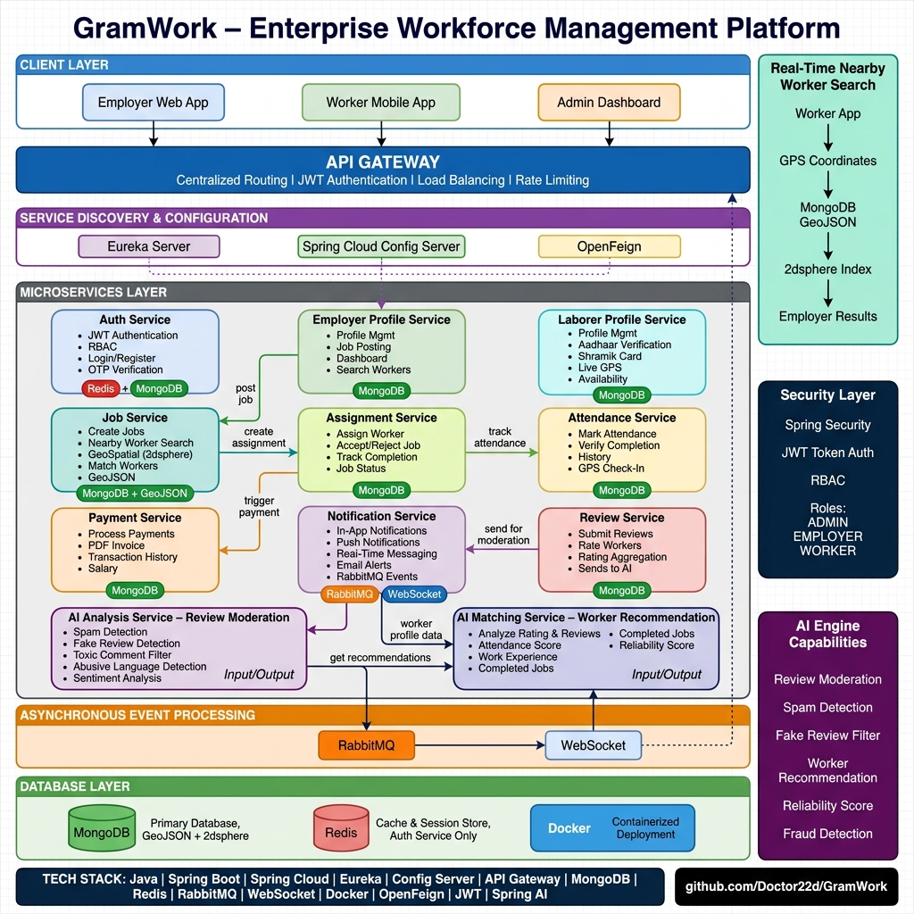

# 🚀 GramWork

> **Enterprise Workforce Management Platform** built with **Java, Spring Boot Microservices, and Spring Cloud**.

GramWork is a scalable, cloud-native backend platform that connects **employers** with **verified workers** through **real-time location-based discovery**, **AI-powered recommendations**, **secure authentication**, and **digital workforce management**.

The project follows a **microservices architecture** with centralized configuration, service discovery, asynchronous messaging, and secure API communication — making it suitable for enterprise-scale backend systems.

---

## 🏗️ System Architecture



---

## ✨ Key Features

### 🔐 Authentication & Security

- JWT Authentication
- Role-Based Access Control (**Admin**, **Employer**, **Worker**)
- OTP Verification using Redis
- Spring Security
- Secure REST APIs

---

### 📍 Real-Time Worker Discovery

- Live GPS location updates
- MongoDB GeoSpatial (`2dsphere`) indexing
- Find nearby workers within a configurable radius
- Distance-based worker recommendations

---

### 🤖 AI-Powered Features

#### AI Worker Recommendation

Generate intelligent worker recommendations based on:

- Worker Rating
- Attendance
- Completed Jobs
- Experience
- Reliability Score
- Employer Reviews

#### AI Review Moderation

Automatically detects:

- Spam Reviews
- Fake Reviews
- Toxic Comments
- Abusive Language

---

### ✅ Worker Verification

- Aadhaar document upload
- Shramik Card upload
- Secure document storage using **Amazon S3**
- Helps reduce fake worker profiles

---

### 💼 Job & Assignment Management

- Job Posting
- Worker Assignment
- Availability Tracking
- Assignment Status Management

---

### 📅 Attendance Management

- Daily Attendance
- Work Completion Verification
- Attendance History

---

### 💳 Payment Service

- Secure Payment Workflow
- Payment History
- Automatic PDF Invoice Generation

---

### 💬 Real-Time Messaging

- RabbitMQ Event Processing
- WebSocket Live Messaging
- In-App Notifications
- Assignment & Payment Updates

---

## 🏛️ Microservices

| Service | Port | Directory | Description |
| --- | --- | --- | --- |
| **API Gateway** | `8080` | `api-gateway` | Request routing, authentication, load balancing |
| **Config Server** | `8888` | `config-server` | Centralized configuration management |
| **Eureka Server** | `8761` | `eureka-server` | Service discovery and registration |
| **Auth Service** | `8086` | `Auth` | Authentication, JWT & RBAC |
| **Worker Profile Service** | `8081` | `laborer-profile` | Worker profile & verification |
| **Employer Profile Service** | `8089` | `employer-profile-service` | Employer management |
| **Job Service** | `8083` | `Job` | Job posting & nearby worker search |
| **Assignment Service** | `8084` | `Assignment-Service` | Assignment lifecycle management |
| **Attendance Service** | — | `Attendence` | Attendance tracking |
| **Payment Service** | `8088` | `paymentService` | Payments & PDF invoices |
| **Notification Service** | `8082` | `NotificationService` | RabbitMQ & WebSocket notifications |
| **Review Service** | — | `ReviewService` | Ratings & reviews |
| **AI Matching Service** | — | `AiMatchingService` | Worker recommendation engine |
| **AI Analysis Service** | — | `AiAnalysisService` | Review moderation & AI analytics |

---

## 🛠️ Technology Stack

### Backend

| Technology | Purpose |
| --- | --- |
| Java 21 | Core Language |
| Spring Boot | Microservices Framework |
| Spring Cloud | Cloud-Native Patterns |

### Spring Cloud Components

| Component | Purpose |
| --- | --- |
| API Gateway | Centralized Routing & Auth |
| Eureka | Service Discovery |
| Spring Cloud Config | Centralized Configuration |
| OpenFeign | Inter-Service REST Communication |

### Security

| Technology | Purpose |
| --- | --- |
| Spring Security | Security Framework |
| JWT | Token-Based Authentication |
| RBAC | Role-Based Access Control |

### Databases & Storage

| Technology | Purpose |
| --- | --- |
| MongoDB | Primary NoSQL Database (GeoSpatial) |
| Redis | Caching, OTP Store, Session Management |
| Amazon S3 | Document & File Storage |

### Messaging

| Technology | Purpose |
| --- | --- |
| RabbitMQ | Asynchronous Message Broker |
| WebSocket | Real-Time Client Push |

### DevOps

| Technology | Purpose |
| --- | --- |
| Docker | Containerization |
| Docker Compose | Multi-Container Orchestration |
| Maven | Build & Dependency Management |

### AI

| Feature | Purpose |
| --- | --- |
| AI Worker Recommendation | Intelligent Worker Matching |
| AI Review Moderation | Spam & Abuse Detection |

---

## 🚀 Getting Started

### Prerequisites

- JDK 21 (`JAVA_HOME` set correctly)
- Maven 3.8+
- Docker & Docker Compose

---

### 1️⃣ Start Infrastructure

```bash
cd Backend
cp .env.example .env    # Edit .env with your actual values
docker compose up -d
```

This starts:

- **MongoDB** — Primary database
- **Redis** — Caching & OTP store
- **RabbitMQ** — Message broker

---

### 2️⃣ Start Core Services (in order)

```bash
# Config Server (start first — other services fetch config from here)
cd Backend/config-server
mvn spring-boot:run

# Eureka Server (start second — services register here)
cd ../eureka-server
mvn spring-boot:run

# API Gateway (start third — routes all client requests)
cd ../api-gateway
mvn spring-boot:run
```

---

### 3️⃣ Start Domain Services

```bash
cd ../Auth
mvn spring-boot:run

cd ../laborer-profile
mvn spring-boot:run

cd ../employer-profile-service
mvn spring-boot:run

cd ../Job
mvn spring-boot:run

cd ../Assignment-Service
mvn spring-boot:run

cd ../NotificationService
mvn spring-boot:run

cd ../paymentService
mvn spring-boot:run

cd ../Attendence
mvn spring-boot:run

cd ../ReviewService
mvn spring-boot:run

cd ../AiMatchingService
mvn spring-boot:run

cd ../AiAnalysisService
mvn spring-boot:run
```

---

### 4️⃣ Build the Entire Project

```bash
cd Backend
mvn clean install
```

---

## 🔐 Authentication

Authenticate through the **Auth Service**:

```
POST /api/auth/login
```

Include the JWT in every protected request:

```
Authorization: Bearer <JWT_TOKEN>
```

### Roles

| Role | Access Level |
| --- | --- |
| `ADMIN` | Full system access |
| `EMPLOYER` | Job posting, worker management |
| `WORKER` | Job applications, attendance |

---

## 📂 Project Structure

```
GramWork/
├── Backend/
│   ├── api-gateway/              # API Gateway (Port 8080)
│   ├── config-server/            # Spring Cloud Config Server
│   ├── config-repository/        # Configuration files repository
│   ├── eureka-server/            # Eureka Service Discovery
│   ├── Auth/                     # Authentication & Authorization
│   ├── laborer-profile/          # Worker Profile Service
│   ├── employer-profile-service/ # Employer Profile Service
│   ├── Job/                      # Job Service (GeoSpatial)
│   ├── Assignment-Service/       # Assignment Management
│   ├── Attendence/               # Attendance Tracking
│   ├── paymentService/           # Payment & Invoicing
│   ├── NotificationService/      # Notifications (RabbitMQ + WebSocket)
│   ├── ReviewService/            # Ratings & Reviews
│   ├── AiMatchingService/        # AI Worker Recommendation
│   ├── AiAnalysisService/        # AI Review Moderation
│   ├── docker-compose.yml        # Infrastructure containers
│   └── .env.example              # Environment variables template
└── README.md
```

---

## 📚 Skills Demonstrated

- Enterprise Java Development
- Backend System Design
- Microservices Architecture
- Distributed Systems
- Spring Cloud Ecosystem
- REST API Development
- Secure Authentication & Authorization
- Event-Driven Architecture
- Real-Time Communication
- AI Integration
- GeoSpatial Search
- Cloud File Storage (Amazon S3)
- Docker Containerization

---

